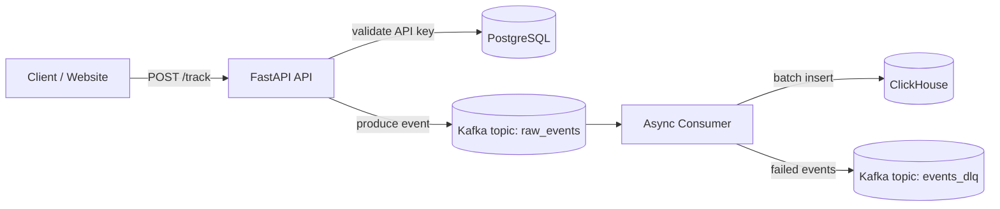

# AnaLightics


**AnaLightics** — это lightweight high-load система для сбора и обработки web analytics / clickstream событий.

Проект демонстрирует, как построить отказоустойчивый event pipeline, который принимает события через API, буферизует их в Kafka, обрабатывает батчами и сохраняет в ClickHouse для дальнейшей аналитики.

---

## Зачем этот проект

AnaLightics создан как pet project для практики backend/high-load архитектуры:

- асинхронный API для приема событий;
- буферизация нагрузки через Kafka;
- batch insert в ClickHouse;
- хранение проектов и API-ключей в PostgreSQL;
- retry-механизм при ошибках записи;
- Dead Letter Queue для событий, которые не удалось обработать;
- запуск всей инфраструктуры через Docker Compose.

---

## Архитектура



### Поток обработки

1. Клиент отправляет событие на `POST /track`.
2. API проверяет `x-api-key` в PostgreSQL.
3. Валидное событие отправляется в Kafka topic `raw_events`.
4. Consumer читает события из Kafka.
5. События накапливаются в буфер.
6. При достижении batch size или flush interval данные записываются в ClickHouse.
7. Если запись не удалась после retry-попыток, события отправляются в DLQ.

---

## Технологический стек

| Компонент | Назначение |
|---|---|
| **FastAPI** | HTTP API для приема analytics-событий |
| **Kafka** | Буферизация и доставка событий |
| **ClickHouse** | Быстрое аналитическое хранилище |
| **PostgreSQL** | Хранение проектов и API-ключей |
| **SQLAlchemy Async** | Асинхронная работа с PostgreSQL |
| **Pydantic** | Валидация входящих событий |
| **Docker Compose** | Локальный запуск всей инфраструктуры |
| **Poetry** | Управление зависимостями backend-приложения |

---

## Возможности

- **Event tracking API**  
  Прием пользовательских событий через HTTP endpoint.

- **API key validation**  
  Каждый запрос проверяется по API-ключу проекта.

- **Kafka buffering**  
  API не пишет напрямую в ClickHouse, а отправляет события в Kafka, чтобы выдерживать пики нагрузки.

- **Batch processing**  
  Consumer пишет события пачками, что эффективнее для аналитического хранилища.

- **Retry logic**  
  При временной ошибке записи consumer повторяет попытку.

- **Dead Letter Queue**  
  Если событие не удалось обработать, оно не теряется, а отправляется в отдельный Kafka topic.

- **Auto schema initialization**  
  Таблица ClickHouse создается на основе Pydantic-модели события.

---

## Структура проекта

```text
AnaLightics/
├── backend/
│   ├── api/
│   │   └── main.py          # FastAPI приложение и endpoint /track
│   ├── consumer/
│   │   └── main.py          # Kafka consumer, batch processing, DLQ
│   ├── db/
│   │   ├── init_db.py       # Инициализация PostgreSQL и ClickHouse
│   │   └── postgres.py      # SQLAlchemy модели и подключение к PostgreSQL
│   ├── model/
│   │   ├── config.py        # Конфигурация из env-переменных
│   │   └── schemas.py       # Pydantic-схемы событий
│   ├── Dockerfile
│   ├── pyproject.toml
│   └── poetry.lock
├── .env.example
├── docker-compose.yaml
└── README.md
```

---

## Быстрый старт

### 1. Склонировать репозиторий

```bash
git clone https://github.com/DaniilTUPYAKOV/AnaLightics.git
cd AnaLightics
```

### 2. Создать `.env`

```bash
cp .env.example .env
```

Открой `.env` и укажи значения для PostgreSQL, ClickHouse, Kafka и API.

Пример минимальной локальной конфигурации:

```env
PROJECT_NAME=analightics

POSTGRES_USER=analightics
POSTGRES_PASSWORD=analightics_password
POSTGRES_DB=analightics
POSTGRES_PORT_EXTERNAL=5432
POSTGRES_HOST=postgres

KAFKA_PORT_EXTERNAL=9092
KAFKA_PORT_INTERNAL=29092
EVENT_TOPIC=raw_events
DLQ_TOPIC=events_dlq

CLICKHOUSE_PORT=8123
CLICKHOUSE_PORT_EXTERNAL=8123
CLICKHOUSE_NATIVE_PORT=9000
CLICKHOUSE_TABLE=analightics.events
CLICKHOUSE_USER=analightics
CLICKHOUSE_PASSWORD=analightics_password
CLICKHOUSE_DB=analightics

CONSUMER_GROUP_ID=analightics_group_v1
CONSUMER_AUTO_OFFSET_RESET=earliest
CONSUMER_MAX_RETRIES=3
CONSUMER_RETRY_DELAY=2
CONSUMER_BATCH_SIZE=1000
CONSUMER_FLUSH_INTERVAL=5.0

API_PORT=8000
API_KEY=secret-demo-key-123
```

> При инициализации создается demo project с API key: `secret-demo-key-123`.

### 3. Запустить проект

```bash
docker compose up --build
```

После запуска будут подняты:

- PostgreSQL;
- ClickHouse;
- Kafka;
- init_db контейнер для инициализации БД;
- FastAPI API;
- Kafka consumer.

---

## API

### Health check

```http
GET /health
```

Пример:

```bash
curl http://localhost:8000/health
```

Ответ:

```json
{
  "status": "healthy",
  "kafka": "connected"
}
```

---

### Отправка события

```http
POST /track
```

Headers:

```http
Content-Type: application/json
x-api-key: secret-demo-key-123
```

Body:

```json
{
  "url": "https://example.com/pricing",
  "title": "Pricing Page",
  "referrer": "https://google.com",
  "user_agent": "Mozilla/5.0",
  "screen_width": 1920,
  "screen_height": 1080,
  "timestamp": "2026-06-07T12:00:00Z",
  "event_type": "page_view"
}
```

Curl пример:

```bash
curl -X POST http://localhost:8000/track \
  -H "Content-Type: application/json" \
  -H "x-api-key: secret-demo-key-123" \
  -d '{
    "url": "https://example.com/pricing",
    "title": "Pricing Page",
    "referrer": "https://google.com",
    "user_agent": "Mozilla/5.0",
    "screen_width": 1920,
    "screen_height": 1080,
    "timestamp": "2026-06-07T12:00:00Z",
    "event_type": "page_view"
  }'
```

Успешный ответ:

```json
{
  "is_valid": true,
  "project_id": "demo-project"
}
```

---

## Модель события

| Поле | Тип | Описание |
|---|---:|---|
| `url` | `string` | URL страницы, на которой произошло событие |
| `title` | `string` | Заголовок страницы |
| `referrer` | `string \| null` | Источник перехода |
| `user_agent` | `string` | Информация о браузере и устройстве |
| `screen_width` | `integer` | Ширина экрана |
| `screen_height` | `integer` | Высота экрана |
| `timestamp` | `string` | Время события |
| `event_type` | `string` | Тип события, например `page_view`, `click`, `submit` |

---

## Конфигурация consumer

Consumer управляется через env-переменные:

| Переменная | Описание |
|---|---|
| `CONSUMER_BATCH_SIZE` | Количество событий в одном batch |
| `CONSUMER_FLUSH_INTERVAL` | Интервал принудительной записи в ClickHouse |
| `CONSUMER_MAX_RETRIES` | Количество retry-попыток |
| `CONSUMER_RETRY_DELAY` | Базовая задержка между retry |
| `CONSUMER_AUTO_OFFSET_RESET` | Политика чтения offset: `earliest` или `latest` |

---

## DLQ

Если событие не удалось обработать, оно отправляется в Kafka topic:

```text
events_dlq
```

В DLQ попадают:

- события с некорректной структурой;
- события, которые не удалось распарсить;
- batch событий, который не удалось записать в ClickHouse после всех retry-попыток.

Это позволяет не терять данные и отдельно разбирать проблемные события.

---

## Roadmap

- [ ] Добавить dashboard для просмотра метрик
- [ ] Добавить frontend tracking script
- [ ] Добавить endpoint для создания проектов и API-ключей
- [ ] Добавить Prometheus/Grafana мониторинг
- [ ] Добавить интеграционные тесты
- [ ] Добавить CI pipeline
- [ ] Добавить нагрузочное тестирование
- [ ] Добавить replay событий из DLQ

---

## Локальная разработка

Перейти в backend:

```bash
cd backend
```

Установить зависимости:

```bash
poetry install
```

Запустить линтер:

```bash
poetry run ruff check .
```

Запустить type check:

```bash
poetry run mypy .
```

Запустить тесты:

```bash
poetry run pytest
```

---

## Автор

**Daniil Tupyakov**

GitHub: [@DaniilTUPYAKOV](https://github.com/DaniilTUPYAKOV)

---

## License

Нет. Пользуйтесь на здоровье

