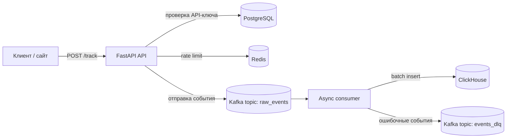

# AnaLightics


**AnaLightics** — легковесная высоконагруженная система для сбора и обработки событий веб-аналитики и clickstream-данных.

Проект показывает, как построить отказоустойчивый событийный конвейер: API принимает события, Kafka буферизует поток, consumer обрабатывает события пачками, а ClickHouse хранит данные для дальнейшей аналитики.

---

## Зачем этот проект

AnaLightics создан как OpenSource система веб аналитики, котора подходит как для локального использвания так и для более крупных проектов. Высокая надежность и скорость системы обусловлена highload вдохновленной архитектурой включающей в себя:

- асинхронный API для приема событий;
- буферизация нагрузки через Kafka;
- пакетная запись в ClickHouse;
- хранение проектов и API-ключей в PostgreSQL;
- безопасное хранение API-ключей через hash и prefix lookup;
- ограничение частоты запросов через Redis;
- retry-механизмы для временных ошибок;
- Dead Letter Queue для событий, которые не удалось обработать;
- единый формат API-ошибок;
- структурированные логи через `structlog`;
- запуск всей инфраструктуры через Docker Compose;
- unit, API и интеграционные тесты.

---

## Архитектура



### Поток обработки

1. Клиент отправляет событие на `POST /track`.
2. API проверяет `x-api-key` в PostgreSQL.
3. API проверяет project-level RPM limit через Redis.
4. Валидное событие отправляется в Kafka topic `raw_events`.
5. Consumer читает события из Kafka.
6. Consumer нормализует событие и накапливает batch.
7. При достижении `CONSUMER_BATCH_SIZE` или `CONSUMER_FLUSH_INTERVAL` batch записывается в ClickHouse.
8. Если сообщение нельзя разобрать или записать после retry-попыток, оно отправляется в DLQ.

---

## Технологический стек

| Компонент | Назначение |
|---|---|
| **FastAPI** | HTTP API для приема analytics-событий |
| **Kafka** | Буферизация и доставка событий |
| **ClickHouse** | Быстрое аналитическое хранилище |
| **PostgreSQL** | Хранение проектов и API-ключей |
| **Redis** | Rate limiting и быстрые runtime-проверки |
| **SQLAlchemy Async** | Асинхронная работа с PostgreSQL |
| **Pydantic** | Валидация входящих событий и конфигурации |
| **Tenacity** | Retry-механизмы |
| **structlog** | Структурированные JSON-логи |
| **Docker Compose** | Локальный запуск инфраструктуры |
| **Poetry** | Управление зависимостями backend-приложения |

---

## Возможности

- **Tracking API**  
  Прием пользовательских событий через HTTP endpoint `/track`.

- **API key authentication**  
  Каждый запрос проверяется по API-ключу проекта. Полный ключ не хранится в базе: сохраняются только HMAC-SHA256 hash и безопасный prefix.

- **Kafka buffering**  
  API не пишет напрямую в ClickHouse, а быстро отправляет события в Kafka. Это помогает выдерживать пики нагрузки и переживать временную недоступность ClickHouse.

- **Batch processing**  
  Consumer пишет события пачками, что эффективнее для аналитического хранилища.

- **Retries**  
  Временные ошибки Kafka и ClickHouse обрабатываются retry-механизмами.

- **Dead Letter Queue**  
  Некорректные или не обработанные события не теряются, а отправляются в отдельный Kafka topic.

- **Rate limiting**  
  Для проекта используется fixed-window RPM limit на Redis.

- **Структурированные логи**  
  API пишет JSON-логи с `request_id`, `project_id`, `event`, `duration_ms` и другими полями.

- **Idempotency-ready events**  
  Клиент обязан передавать `event_id`. Повторная отправка того же события должна использовать тот же `event_id`.

---

## Структура проекта

```text
AnaLightics/
├── backend/
│   ├── api/
│   │   ├── exceptions.py       # Единый формат API-ошибок
│   │   ├── logging_config.py   # Настройка structlog
│   │   ├── main.py             # FastAPI приложение и endpoints
│   │   └── rate_limit.py       # Fixed-window rate limiter
│   ├── consumer/
│   │   └── main.py             # Kafka consumer, batch processing, DLQ
│   ├── db/
│   │   ├── init_db.py          # Инициализация PostgreSQL и ClickHouse
│   │   └── postgres.py         # SQLAlchemy модели и фабрики подключения
│   ├── model/
│   │   ├── auth.py             # Генерация и проверка API-ключей
│   │   ├── config.py           # Settings из env-переменных
│   │   └── schemas.py          # Pydantic-схемы
│   ├── repositories/
│   │   └── projects.py         # Работа с проектами и API-ключами
│   ├── tests/
│   │   ├── api/
│   │   ├── integration/
│   │   └── unit/
│   ├── Dockerfile
│   ├── pyproject.toml
│   └── poetry.lock
├── .env.example
├── .env.test.example
├── docker-compose.yaml
├── docker-compose.test.yaml
└── README.md
```

---

## Быстрый старт

### 1. Склонировать репозиторий

```bash
git clone https://github.com/DaniilTUPYAKOV/AnaLightics.git
cd AnaLightics
```

### 2. Создать `.env`

```bash
cp .env.example .env
```

Открой `.env` и укажи значения для PostgreSQL, Redis, Kafka, ClickHouse и API.

Пример минимальной локальной конфигурации:

```env
PROJECT_NAME=analightics

POSTGRES_USER=analightics
POSTGRES_PASSWORD=analightics_password
POSTGRES_DB=analightics
POSTGRES_PORT_EXTERNAL=5432
POSTGRES_HOST=postgres

REDIS_HOST=redis
REDIS_PORT=6379
REDIS_DB=0
REDIS_SOCKET_TIMEOUT_SECONDS=1

KAFKA_PORT_EXTERNAL=9092
KAFKA_PORT_INTERNAL=29092
KAFKA_BOOTSTRAP_SERVERS=kafka:29092
EVENT_TOPIC=raw_events
DLQ_TOPIC=events_dlq
KAFKA_PRODUCER_ACKS=1
KAFKA_PRODUCER_REQUEST_TIMEOUT_MS=5000
KAFKA_PRODUCER_SEND_TIMEOUT_SECONDS=5
KAFKA_PRODUCER_START_TIMEOUT_SECONDS=10
KAFKA_PRODUCER_MAX_RETRIES=3
KAFKA_PRODUCER_RETRY_DELAY_SECONDS=0.1
KAFKA_PRODUCER_RETRY_MAX_DELAY_SECONDS=1

CLICKHOUSE_PORT=8123
CLICKHOUSE_PORT_EXTERNAL=8123
CLICKHOUSE_NATIVE_PORT=9000
CLICKHOUSE_TABLE=events
CLICKHOUSE_USER=analightics
CLICKHOUSE_PASSWORD=analightics_password
CLICKHOUSE_DB=analightics

CONSUMER_GROUP_ID=analightics_group_v1
CONSUMER_AUTO_OFFSET_RESET=earliest
CONSUMER_MAX_RETRIES=3
CONSUMER_RETRY_DELAY=2
CONSUMER_BATCH_SIZE=1000
CONSUMER_FLUSH_INTERVAL=5.0

API_PORT=8000
API_KEY=secret-demo-key-123
API_KEY_HASH_SECRET=replace_with_a_long_random_secret
```

При инициализации создается demo project с id `00000000-0000-0000-0000-000000000001` и API key из `API_KEY`.

### 3. Запустить проект

```bash
docker compose up --build
```

После запуска будут подняты:

- PostgreSQL;
- Redis;
- ClickHouse;
- Kafka;
- init_db контейнер для инициализации БД;
- FastAPI API;
- Kafka consumer.

---

## API

### Проверка состояния

```http
GET /health
```

Пример:

```bash
curl http://localhost:8000/health
```

Ответ:

```json
{
  "status": "healthy",
  "kafka": "connected",
  "redis": "connected"
}
```

### Проверка готовности

```http
GET /ready
```

Пример:

```bash
curl http://localhost:8000/ready
```

Успешный ответ:

```json
{
  "status": "ready",
  "kafka": "connected",
  "redis": "connected"
}
```

Во время graceful shutdown endpoint возвращает `503 Service Unavailable`. Если Kafka producer или Redis недоступны, endpoint тоже возвращает `503 Service Unavailable`.

### Отправка события

```http
POST /track
```

Эндпоинт использует ограничение частоты запросов на уровне проекта: fixed-window rate limiting в Redis. Если проект превышает `rate_limit_per_minute`, API возвращает `429 Too Many Requests`. Если Redis недоступен, API закрывает прием событий и возвращает `503 Service Unavailable`.

Заголовки:

```http
Content-Type: application/json
x-api-key: secret-demo-key-123
```

Тело запроса:

```json
{
  "event_id": "00000000-0000-0000-0000-000000000003",
  "url": "https://example.com/pricing",
  "title": "Pricing Page",
  "referrer": "https://google.com",
  "user_agent": "Mozilla/5.0",
  "screen_width": 1920,
  "screen_height": 1080,
  "timestamp": "2026-06-07T12:00:00Z",
  "event_type": "page_view"
}
```

`event_id` обязателен и должен генерироваться клиентом. При повторной отправке того же события нужно использовать тот же `event_id`.

Curl-пример:

```bash
curl -X POST http://localhost:8000/track \
  -H "Content-Type: application/json" \
  -H "x-api-key: secret-demo-key-123" \
  -d '{
    "event_id": "00000000-0000-0000-0000-000000000003",
    "url": "https://example.com/pricing",
    "title": "Pricing Page",
    "referrer": "https://google.com",
    "user_agent": "Mozilla/5.0",
    "screen_width": 1920,
    "screen_height": 1080,
    "timestamp": "2026-06-07T12:00:00Z",
    "event_type": "page_view"
  }'
```

Успешный ответ:

```json
{
  "is_valid": true,
  "project_id": "00000000-0000-0000-0000-000000000001"
}
```

### Создание API-ключа

```http
POST /projects/{project_id}/api-keys
```

Заголовки:

```http
Content-Type: application/json
x-api-key: secret-demo-key-123
```

Тело запроса:

```json
{
  "name": "Production tracking key"
}
```

Успешный ответ:

```json
{
  "id": "8e558dd8-2fd7-4db4-b9b8-8628517da5de",
  "project_id": "00000000-0000-0000-0000-000000000001",
  "name": "Production tracking key",
  "key_prefix": "ak_live_abc12345",
  "api_key": "ak_live_abc12345..."
}
```

Полный `api_key` возвращается только один раз при создании. В PostgreSQL хранится HMAC-SHA256 hash и безопасный `key_prefix`; авторизация сначала ищет кандидатов по prefix, а затем проверяет полный ключ по hash.

### Ротация API-ключа

```http
POST /projects/{project_id}/api-keys/{api_key_id}/rotate
```

Эндпоинт отзывает старый активный ключ и создает новый ключ для того же проекта.

### Отзыв API-ключа

```http
POST /projects/{project_id}/api-keys/{api_key_id}/revoke
```

Эндпоинт деактивирует активный ключ проекта.

---

## Формат ошибок API

API возвращает ошибки в едином формате:

```json
{
  "error": {
    "code": "RATE_LIMIT_EXCEEDED",
    "message": "Too many events",
    "request_id": "7cc3e0e1-0000-4000-9000-000000000000",
    "details": {}
  }
}
```

`request_id` также возвращается в header `X-Request-ID`. API генерирует новый UUID для каждого запроса.

Примеры кодов:

| Code | HTTP | Значение |
|---|---:|---|
| `AUTH_REQUIRED` | 401 | API-ключ не передан |
| `API_KEY_INVALID` | 403 | API-ключ невалиден, неактивен или не имеет доступа |
| `VALIDATION_ERROR` | 422 | Ошибка валидации body/query/path |
| `RATE_LIMIT_EXCEEDED` | 429 | Проект превысил лимит событий |
| `KAFKA_UNAVAILABLE` | 503 | Прием событий временно недоступен |
| `KAFKA_TIMEOUT` | 504 | Отправка события в Kafka превысила timeout |
| `INTERNAL_ERROR` | 500 | Непредвиденная ошибка сервера |

---

## Структурированные логи

API пишет JSON-логи через `structlog`. Поле `event` — стабильное имя события, а контекст (`request_id`, `project_id`, `topic`, `duration_ms`) записывается отдельными top-level полями.

Пример:

```json
{
  "timestamp": "2026-06-18T10:30:00.000000+00:00",
  "level": "info",
  "logger": "backend.api.main",
  "event": "track_request_completed",
  "request_id": "7cc3e0e1-0000-4000-9000-000000000000",
  "project_id": "00000000-0000-0000-0000-000000000001",
  "api_key_id": "8e558dd8-2fd7-4db4-b9b8-8628517da5de",
  "topic": "raw_events",
  "event_type": "page_view",
  "duration_ms": 18.4,
  "kafka_duration_ms": 12.5
}
```

Основные события API:

| Event | Значение |
|---|---|
| `track_request_completed` | `/track` успешно обработан |
| `kafka_send_failed` | Ошибка отправки в Kafka |
| `kafka_send_retrying` | Повторная попытка отправки в Kafka |
| `rate_limit_check_failed` | Ошибка проверки rate limit в Redis |
| `api_error` | Ожидаемая API-ошибка отрендерена в едином формате |
| `unhandled_api_error` | Непредвиденная ошибка обработана fallback handler-ом |

Эти поля удобно фильтровать в Loki, ELK, Grafana и других системах наблюдаемости.

---

## Модель события

| Поле | Тип | Описание |
|---|---:|---|
| `event_id` | `uuid` | Уникальный id события, сгенерированный клиентом |
| `url` | `url` | URL страницы, на которой произошло событие |
| `title` | `string` | Заголовок страницы, 1-300 символов |
| `referrer` | `url \| null` | Источник перехода |
| `user_agent` | `string` | Информация о браузере и устройстве, 1-1000 символов |
| `screen_width` | `integer` | Ширина экрана, 1-16384 |
| `screen_height` | `integer` | Высота экрана, 1-16384 |
| `timestamp` | `datetime` | Время события в ISO-формате |
| `event_type` | `string` | Тип события, например `page_view`, `click`, `submit`; формат `^[a-z][a-z0-9_]*$`, до 64 символов |

---

## Идемпотентность и дубли

`POST /track` принимает `event_id`, сгенерированный клиентом. Повторная отправка того же события должна использовать тот же `event_id`.

В ClickHouse таблица создается с:

```sql
ENGINE = ReplacingMergeTree()
ORDER BY (project_id, event_id)
```

Это делает систему готовой к дедупликации по `(project_id, event_id)`. Важно: `ReplacingMergeTree` схлопывает дубли асинхронно во время background merge. До merge обычный `SELECT` может временно видеть дубли; для строгого чтения нужен `FINAL`, materialized view или отдельный query/read layer.

---

## Конфигурация consumer

Consumer управляется через env-переменные:

| Переменная | Описание |
|---|---|
| `CONSUMER_BATCH_SIZE` | Количество событий в одном batch |
| `CONSUMER_FLUSH_INTERVAL` | Интервал принудительной записи в ClickHouse |
| `CONSUMER_MAX_RETRIES` | Количество retry-попыток |
| `CONSUMER_RETRY_DELAY` | Базовая задержка между retry |
| `CONSUMER_AUTO_OFFSET_RESET` | Политика чтения offset: `earliest` или `latest` |

---

## DLQ

Если событие не удалось обработать, оно отправляется в Kafka topic:

```text
events_dlq
```

В DLQ попадают:

- события с некорректной структурой;
- события без обязательного `event_id`;
- события, которые не удалось распарсить;
- batch событий, который не удалось записать в ClickHouse после всех retry-попыток.

Это позволяет не терять данные и отдельно разбирать проблемные события.

---

## Тестирование

Тесты разделены по уровням:

```text
backend/tests/unit
backend/tests/api
backend/tests/integration
```

`unit` — быстрые тесты без внешних сервисов. Они проверяют чистую логику: API key helpers, Pydantic-схемы, rate limit helpers, consumer/init_db helper-функции.

`api` — тесты FastAPI-контракта через ASGI-клиент. Они отправляют HTTP-запросы в приложение, но подменяют внешние сервисы тестовыми объектами.

`integration` — тесты, которым нужна внешняя инфраструктура. Сейчас это repository tests для PostgreSQL: создание, поиск, ротация и отзыв API-ключей.

### Unit-тесты

```bash
cd backend
python -m pytest tests/unit
```

### API tests

```bash
cd backend
python -m pytest tests/api
```

### Интеграционные тесты

Интеграционные тесты используют отдельный тестовый Postgres из `docker-compose.test.yaml`.

Создать локальный env-файл для тестового контура:

```bash
cp .env.test.example .env.test
```

Поднять тестовый Postgres:

```bash
docker compose --env-file .env.test -f docker-compose.test.yaml up -d postgres-test
```

Запустить integration tests:

```bash
cd backend
python -m pytest tests/integration
```

Остановить тестовый Postgres:

```bash
docker compose --env-file .env.test -f docker-compose.test.yaml down
```

Удалить тестовый volume и начать с чистого состояния:

```bash
docker compose --env-file .env.test -f docker-compose.test.yaml down -v
```

### Запуск по marker

Repository tests помечены marker-ом `integration`, поэтому можно запускать тесты так:

```bash
python -m pytest -m "not integration"
python -m pytest -m integration
```

### Все тесты

```bash
cd backend
python -m pytest tests
```

Важно: integration fixtures содержат safety guard и откажутся пересоздавать таблицы, если имя тестовой БД не заканчивается на `_test`.

---

## Локальная разработка

Перейти в backend:

```bash
cd backend
```

Установить зависимости:

```bash
poetry install
```

Запустить линтер:

```bash
poetry run ruff check .
```

Запустить type check:

```bash
poetry run mypy .
```

Запустить тесты:

```bash
poetry run pytest
```

---

## Планы

- [ ] Добавить dashboard для просмотра метрик
- [ ] Добавить frontend tracking script
- [ ] Добавить endpoint для создания проектов
- [ ] Добавить Prometheus/Grafana мониторинг
- [ ] Добавить end-to-end тесты полного пути API -> Kafka -> consumer -> ClickHouse
- [ ] Добавить CI pipeline
- [ ] Добавить нагрузочное тестирование
- [ ] Добавить replay событий из DLQ
- [ ] Добавить read model для дедуплицированных аналитических запросов

---

## Автор

**Daniil Tupyakov**

GitHub: [@DaniilTUPYAKOV](https://github.com/DaniilTUPYAKOV)

---

## Лицензия

Лицензия не указана.
